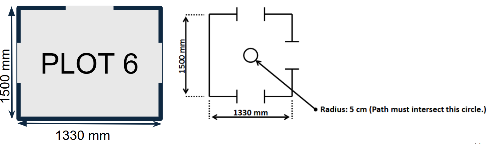

# Portfoilo 

<h2 align="left">Education</h2>

<table>
  <tr>
    <th>Qualification</th>
    <th>Course</th>
    <th>Institution</th>
  </tr>
    <tr>
    <td>Bachelor's Degree</td>
    <td>Robotic System</td>
    <td>Singapore Insitution of Technology <em>(Currently Undergoing)</em></td>
  </tr>
  <tr>
    <td>Diploma</td>
    <td>System Engineering & Management</td>
    <td>Republic Polytechnic <em>(March 2023)</em></td>
  </tr>
  <tr>
    <td>Certificate in Higher Nitec</td>
    <td>Offshore & Marine Engineering Design</td>
    <td>ITE Central <em>(March 2017)</em></td>
  </tr>
</table>

## Project
### Limo Robot Navigation
Technical Skill: <strong>[ROS]</strong>  <strong>[Gazebo]</strong>  <strong>[Python]</strong>  <strong>[RtabMap]</strong> 
#### Overview
The objective of this project was to enable the Limo Robot to autonomously navigate through various environments designed by our group and others. The robot had to determine and follow the correct route through different zones using mapping, localization, and path planning techniques.
#### Limo Robot
 
In this project, our group utilized the Limo robot as the main robotic platform to explore autonomous navigation in complex environments. To enable the robot to perceive and understand its surroundings, we implemented RTAB-Map (Real-Time Appearance-Based Mapping), a robust SLAM (Simultaneous Localization and Mapping) solution. RTAB-Map allowed the Limo robot to create and update detailed 3D maps of the environment in real time, facilitating accurate localization and environmental awareness.

For autonomous movement, we integrated the ROS navigation stack, which relies heavily on route planning supported by global and local costmaps. The global costmap provides a broad, high-level representation of obstacles and free space across the entire mapped area, enabling strategic route planning to find the optimal path from the robot’s current position to its goal.

The local costmap focuses on the immediate vicinity around the robot and dynamically incorporates sensor data to detect and avoid obstacles in real time. An important aspect of the navigation setup is the management of clearance—the safe spacing between the planned route and nearby walls or obstacles. This clearance is configured within the costmaps and navigation parameters to ensure the robot maintains a safe distance from obstacles, reducing collision risk and allowing smooth navigation even in narrow or cluttered environments.

By combining real-time mapping, dynamic obstacle avoidance, route planning, and clearance management, our system enables the Limo robot to navigate efficiently and safely.

All software development was conducted primarily using Python, leveraging its strong integration with ROS for sensor data processing, motion control, mapping, localization, route planning, obstacle avoidance, and clearance management.
#### Area Environment
 
n the arena, our group was assigned Plot 6, which measures 1330 mm (width) x 1500 mm (depth). We were tasked with designing an environment that not only offered visual appeal but also supported functional navigation for the Limo Robot. Our design was inspired by the Jewel Changi Airport's Canopy Park and the iconic Mastercard Canopy Bridge, both known for their lush greenery, immersive experiences, and suspended walkways.

Key features of our environment include:

- Central Clear Pathway: The middle section of Plot 6 was deliberately kept flat and open using a wooden-tile-style floor to ensure the Limo Robot could traverse through without obstruction. This was essential to meet the robot navigation requirements and align with the central passageway of the arena's layout.

- Miniature Canopy Bridges: Suspended elements on both ends of the central path replicate the Mastercard Canopy Bridge. While visually prominent, these bridges were carefully positioned above the robot’s height limit to avoid interference with its movement or sensor readings.

- Vertical Green Walls: Dense artificial greenery lined the borders of the plot, simulating a natural garden environment and guiding the robot visually and spatially.

- Thematic Zones:

  - A shaded rest area inspired by forest shelters, topped with a brown arched canopy.

  - A stone-feature zone emulating natural seating spaces.

  - Floral decorations to create a vibrant, nature-inspired ambiance.

Throughout the design process, careful attention was given to spacing, obstacle height, and layout orientation to ensure smooth integration with RTAB-Map’s SLAM and ROS-based navigation. The final environment successfully blended aesthetic inspiration with robotic functional requirements, allowing the Limo Robot to autonomously map, localize, and navigate through the plot with real-time decision-making capabilities.
