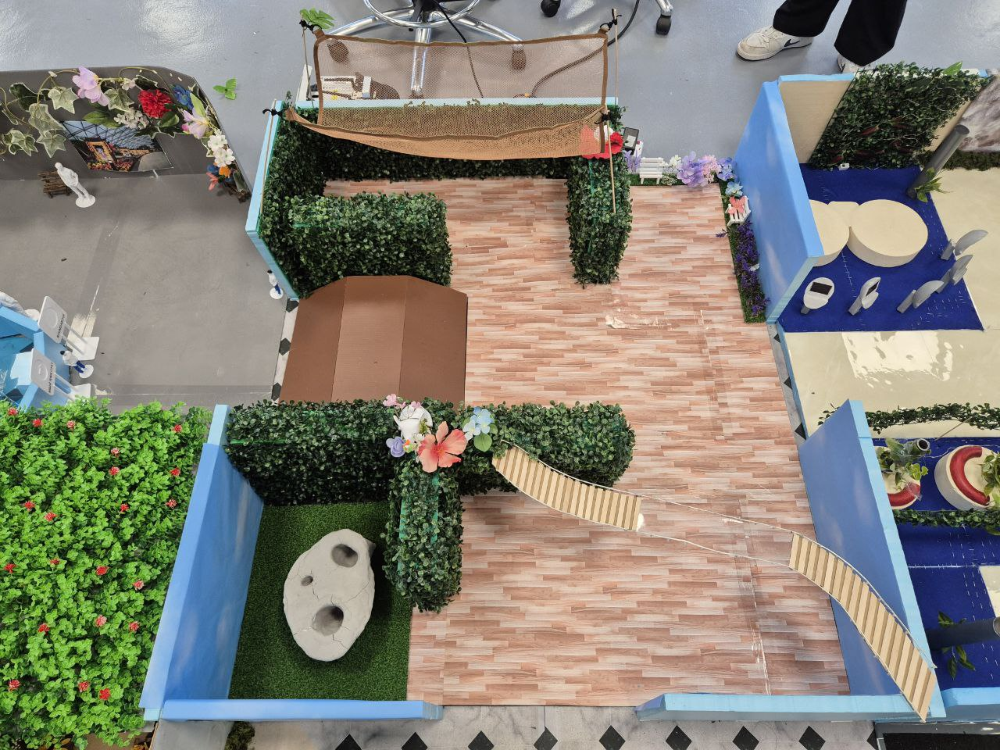

# Portfoilo 

<h2 align="left">Education</h2>

<table>
  <tr>
    <th>Qualification</th>
    <th>Course</th>
    <th>Institution</th>
  </tr>
    <tr>
    <td>Bachelor's Degree</td>
    <td>Robotic System</td>
    <td>Singapore Insitution of Technology <em>(Currently Undergoing)</em></td>
  </tr>
  <tr>
    <td>Diploma</td>
    <td>System Engineering & Management</td>
    <td>Republic Polytechnic <em>(March 2023)</em></td>
  </tr>
  <tr>
    <td>Certificate in Higher Nitec</td>
    <td>Offshore & Marine Engineering Design</td>
    <td>ITE Central <em>(March 2017)</em></td>
  </tr>
</table>

## Project
###  Autonomous Indoor Navigation with AgileX LIMO Robot
**Technical Skills**  
- **Robot Platform:** AgileX LIMO Robot (4WD)  
- **Middleware:** ROS1 Melodic, TF, roslaunch, rosbag, rqt_graph  
- **Languages:** Python  
- **Simulation:** Gazebo, RViz  
- **Mapping & Localization:** gmapping, rtabmap_ros, amcl  
- **Navigation:** move_base, costmap_2d  
- **Control:** cmd_vel, Teleop, Autonomous Path Planning  

#### Overview
The objective of this project was to enable the Limo Robot to autonomously navigate through various environments designed by our group and others. The robot had to determine and follow the correct route through different zones using mapping, localization, and path planning techniques.
#### Limo Robot
 
In this project, our group utilized the AgileX LIMO robot as the primary robotic platform to explore and implement autonomous navigation in complex indoor environments. The system centers on real-time perception, mapping, and motion planning to achieve reliable and safe robot navigation.

- Mapping and Localization
To enable the robot to perceive and understand its surroundings, we implemented RTAB-Map (Real-Time Appearance-Based Mapping), a robust SLAM (Simultaneous Localization and Mapping) solution. RTAB-Map allows the LIMO robot to build and continuously update detailed 3D maps of its environment, facilitating accurate localization and environmental awareness. Localization is further enhanced using AMCL (Adaptive Monte Carlo Localization) to estimate the robot’s pose within the generated maps.

- Navigation and Path Planning
For autonomous movement, we integrated the ROS navigation stack, which leverages global and local costmaps to support path planning and obstacle avoidance:
  - Global costmap: Provides a broad, high-level overview of the environment, marking obstacles and free space across the entire mapped area. This enables strategic route planning, allowing the robot to find an optimal path from its current location to the goal.
  - Local costmap: Focuses on the immediate surroundings of the robot and is updated in real time with sensor data (such as from LIDAR). It dynamically detects obstacles and supports reactive local avoidance maneuvers.
  A critical component of our navigation system is clearance management — the configuration of safe distances between the robot’s planned path and nearby walls or obstacles. Proper clearance settings ensure that the robot maintains a safe buffer, reducing collision risks and enabling smooth navigation even in narrow or cluttered spaces.
- Obstacle Detection and Avoidance
Using LIDAR sensors and the costmap framework, the robot can detect obstacles dynamically and adjust its path accordingly to avoid collisions, ensuring robust operation in changing environments.
- Control and Command Handling
The system supports both manual teleoperation and fully autonomous control modes, allowing seamless switching between human-driven commands and autonomous navigation via the ROS move_base node.

- Software Development
All software components and algorithm integrations were developed primarily in Python, leveraging its deep integration with ROS for sensor data processing, motion control, mapping, localization, route planning, obstacle avoidance, and clearance management.

#### Area Environment
 
In the arena, our group was assigned Plot 6, which measures 1330 mm (width) x 1500 mm (depth). We were tasked with designing an environment that not only offered visual appeal but also supported functional navigation for the Limo Robot. Our design was inspired by the Jewel Changi Airport's Canopy Park and the iconic Mastercard Canopy Bridge, both known for their lush greenery, immersive experiences, and suspended walkways.

 
Key features of our environment include:

- Central Clear Pathway: The middle section of Plot 6 was deliberately kept flat and open using a wooden-tile-style floor to ensure the Limo Robot could traverse through without obstruction. This was essential to meet the robot navigation requirements and align with the central passageway of the arena's layout.

- Miniature Canopy Bridges: Suspended elements on both ends of the central path replicate the Mastercard Canopy Bridge. While visually prominent, these bridges were carefully positioned above the robot’s height limit to avoid interference with its movement or sensor readings.

- Miniature Sky Net: a raised mesh-like structure above the central path provided a thematic canopy effect while maintaining enough clearance to avoid interfering with the Limo Robot’s sensors and navigation. It enhanced the visual design without compromising functionality.

- Vertical Green Walls: Dense artificial greenery lined the borders of the plot, simulating a natural garden environment and guiding the robot visually and spatially.

- Thematic Zones:

  - A shaded rest area inspired by forest shelters, topped with a brown arched canopy.

  - A stone-feature zone emulating natural seating spaces.

  - Floral decorations to create a vibrant, nature-inspired ambiance.

Throughout the design process, careful attention was given to spacing, obstacle height, and layout orientation to ensure smooth integration with RTAB-Map’s SLAM and ROS-based navigation. The final environment successfully blended aesthetic inspiration with robotic functional requirements, allowing the Limo Robot to autonomously map, localize, and navigate through the plot with real-time decision-making capabilities.
