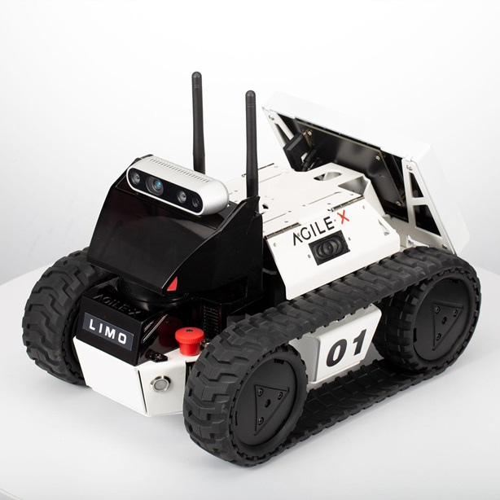

# First-Year Robotic System Student in SIT

## Education
- Diploma, System Engineering & Management | Republic Polytechnic (_2021_)

## Project
### Limo Robot Navigation
Technical Skill: [ROS] [Gazebo] [Python]
#### Overview
The objective of this project was to enable the Limo Robot to autonomously navigate through various environments designed by our group and others. The robot had to determine and follow the correct route through different zones using mapping, localization, and path planning techniques.  

